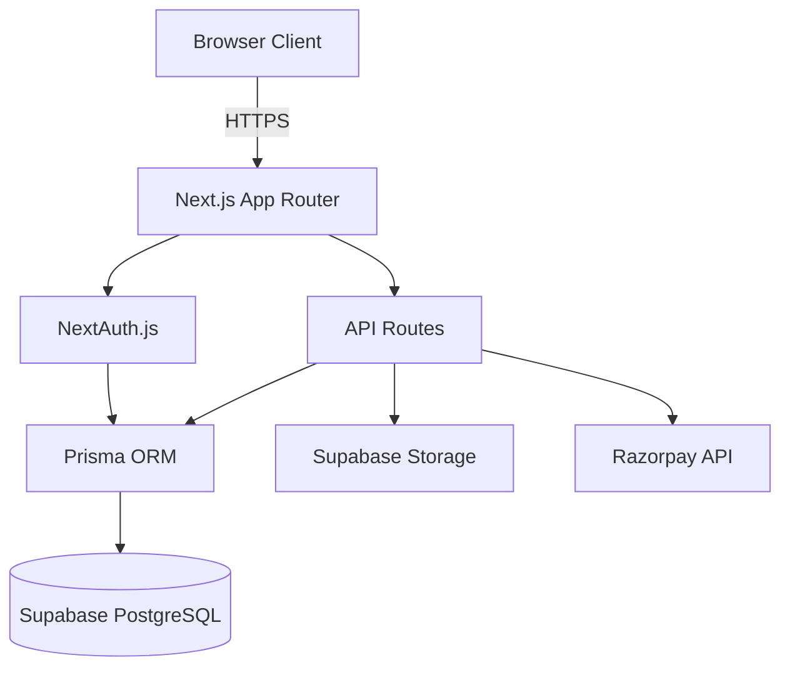

# Design Document

## Overview

FlipBook DRM is built as a Next.js 14 application using the App Router architecture, with server-side rendering and API routes for backend functionality. The system uses Supabase PostgreSQL for data persistence via Prisma ORM, Supabase Storage for file management, NextAuth for authentication, and Razorpay for payment processing. The frontend uses React 19 with TypeScript and Tailwind CSS for styling.

## Architecture

### High-Level Architecture



### Application Structure

```
app/
├── (auth)/
│   ├── login/page.tsx          # Login page
│   └── register/page.tsx       # Registration page
├── dashboard/
│   ├── page.tsx                # Main dashboard
│   ├── documents/[id]/page.tsx # Document details & analytics
│   └── subscription/page.tsx   # Subscription management
├── view/[shareKey]/page.tsx    # Public document viewer
├── api/
│   ├── auth/[...nextauth]/route.ts  # NextAuth configuration
│   ├── documents/
│   │   ├── route.ts            # List/upload documents
│   │   ├── [id]/route.ts       # Get/delete document
│   │   └── [id]/share/route.ts # Create share links
│   ├── share/
│   │   ├── [shareKey]/route.ts # Validate share link
│   │   └── [shareKey]/view/route.ts # Record view analytics
│   ├── analytics/[documentId]/route.ts # Get analytics
│   └── subscription/
│       ├── create-order/route.ts    # Create Razorpay order
│       └── verify-payment/route.ts  # Verify payment
├── layout.tsx                  # Root layout
└── page.tsx                    # Landing page

components/
├── auth/
│   ├── LoginForm.tsx           # Login form component
│   └── RegisterForm.tsx        # Registration form component
├── dashboard/
│   ├── DocumentList.tsx        # List of user documents
│   ├── DocumentCard.tsx        # Individual document card
│   ├── UploadButton.tsx        # Upload trigger
│   ├── UploadModal.tsx         # Upload modal dialog
│   ├── ShareLinkModal.tsx      # Share link creation modal
│   └── AnalyticsChart.tsx      # View analytics visualization
├── pdf/
│   ├── PDFViewer.tsx           # Main PDF viewer component
│   ├── PDFPage.tsx             # Single page renderer
│   └── Watermark.tsx           # Watermark overlay
├── security/
│   ├── DRMProtection.tsx       # DRM event handlers
│   └── DevToolsDetector.tsx    # DevTools detection
├── subscription/
│   ├── PlanCard.tsx            # Subscription plan display
│   └── RazorpayButton.tsx      # Payment button
└── ui/
    ├── Button.tsx              # Reusable button
    ├── Input.tsx               # Form input
    ├── Modal.tsx               # Modal dialog
    └── Card.tsx                # Card container

lib/
├── auth.ts                     # NextAuth configuration
├── db.ts                       # Prisma client singleton
├── storage.ts                  # Supabase storage utilities
├── razorpay.ts                 # Razorpay client
├── validation.ts               # Input validation utilities
└── utils.ts                    # General utilities
```

## Components and Interfaces

### Authentication System

**NextAuth Configuration** (`lib/auth.ts`)
- Uses Credentials provider with email/password
- Custom authorize function validates credentials against database
- JWT strategy for session management
- Session callback includes user ID and subscription tier

**Login/Register Pages**
- Server-side rendered forms with client-side validation
- Password hashing with bcryptjs (12 rounds)
- Redirect to dashboard on successful authentication
- Error handling for invalid credentials or duplicate emails

### Document Management

**Upload Flow**
1. User clicks upload button → Opens modal with file input
2. Client validates file (PDF, max 50MB)
3. POST to `/api/documents` with FormData
4. Server validates subscription limits
5. Upload to Supabase Storage at `{userId}/{documentId}.pdf`
6. Create Document record in database
7. Return document metadata to client

**Document Storage Structure**
- Supabase bucket: `documents`
- Path format: `{userId}/{documentId}.pdf`
- Private bucket with RLS policies
- Signed URLs for temporary access

**API Endpoints**

`GET /api/documents`
- Returns all documents for authenticated user
- Includes document metadata and storage usage
- Sorted by creation date (newest first)

`POST /api/documents`
- Accepts multipart/form-data with PDF file
- Validates file type, size, and subscription limits
- Stores file and creates database record
- Returns created document object

`GET /api/documents/[id]`
- Returns single document with share links and analytics count
- Verifies user ownership

`DELETE /api/documents/[id]`
- Deletes file from storage
- Cascades delete to share links and analytics (via Prisma)
- Updates user storage usage

`POST /api/documents/[id]/share`
- Creates ShareLink with optional expiration, password, maxViews
- Generates cryptographically secure shareKey (32 bytes, base64url)
- Returns share URL: `{APP_URL}/view/{shareKey}`

### Share Link and Viewer

**Share Link Validation Flow**
1. User accesses `/view/{shareKey}`
2. Server validates shareKey exists and isActive
3. Check expiration date (if set)
4. Check view count vs maxViews (if set)
5. If password protected, show password prompt
6. If valid, show email prompt for watermark
7. Render PDF viewer with DRM protection

**PDF Viewer Component** (`components/pdf/PDFViewer.tsx`)
- Uses pdfjs-dist library for rendering
- Loads PDF from signed URL (1-hour expiration)
- Renders pages individually (not entire document)
- Applies watermark overlay to each page
- Implements DRM protection hooks

**Watermark Implementation** (`components/pdf/Watermark.tsx`)
- SVG overlay positioned absolutely over PDF canvas
- Text content: `{viewerEmail} - {timestamp}`
- Diagonal rotation (45 degrees)
- Semi-transparent (opacity 0.3)
- Repeated pattern across page

**DRM Protection** (`components/security/DRMProtection.tsx`)
- Disables context menu (onContextMenu preventDefault)
- Disables text selection (CSS user-select: none)
- Blocks keyboard shortcuts:
  - Ctrl+C, Ctrl+X (copy/cut)
  - Ctrl+P (print)
  - Ctrl+S (save)
  - Ctrl+U (view source)
  - F12 (DevTools)
- DevTools detection using window size changes and debugger statements

### Analytics Tracking

**View Recording Flow**
1. When PDF viewer loads, POST to `/api/share/[shareKey]/view`
2. Server creates ViewAnalytics record with:
   - documentId (from ShareLink)
   - shareKey
   - viewerEmail (from form)
   - ipAddress (from request headers)
   - userAgent (from request headers)
   - viewedAt (current timestamp)
3. Increment ShareLink.viewCount
4. Optional: Call IP geolocation API for country/city

**Analytics Display** (`app/dashboard/documents/[id]/page.tsx`)
- Fetch analytics from `/api/analytics/[documentId]`
- Display metrics:
  - Total views
  - Unique viewers (distinct emails)
  - View timeline chart (views per day)
  - Viewer table (email, timestamp, location, IP)
- Chart using HTML canvas or SVG

### Subscription Management

**Subscription Tiers**
```typescript
const PLANS = {
  free: {
    name: 'Free',
    storage: 100 * 1024 * 1024, // 100MB
    maxDocuments: 5,
    price: 0
  },
  pro: {
    name: 'Pro',
    storage: 10 * 1024 * 1024 * 1024, // 10GB
    maxDocuments: Infinity,
    price: 99900 // ₹999 in paise
  },
  enterprise: {
    name: 'Enterprise',
    storage: Infinity,
    maxDocuments: Infinity,
    price: 499900 // ₹4999 in paise
  }
}
```

**Payment Flow**
1. User selects plan on subscription page
2. Click "Upgrade" → POST to `/api/subscription/create-order`
3. Server creates Razorpay order with amount and currency
4. Client opens Razorpay checkout modal
5. User completes payment
6. Razorpay callback with payment details
7. POST to `/api/subscription/verify-payment` with signature verification
8. Server creates Subscription record with 30-day duration
9. Update User.subscription field
10. Redirect to dashboard with success message

**Razorpay Integration** (`lib/razorpay.ts`)
```typescript
import Razorpay from 'razorpay';

export const razorpay = new Razorpay({
  key_id: process.env.RAZORPAY_KEY_ID!,
  key_secret: process.env.RAZORPAY_KEY_SECRET!
});

export function verifyPaymentSignature(
  orderId: string,
  paymentId: string,
  signature: string
): boolean {
  const crypto = require('crypto');
  const text = `${orderId}|${paymentId}`;
  const generated = crypto
    .createHmac('sha256', process.env.RAZORPAY_KEY_SECRET!)
    .update(text)
    .digest('hex');
  return generated === signature;
}
```

## Data Models

The Prisma schema is already defined. Key relationships:

- User → Documents (one-to-many)
- User → ShareLinks (one-to-many)
- User → Subscriptions (one-to-many)
- Document → ShareLinks (one-to-many)
- Document → ViewAnalytics (one-to-many)

**Database Indexes**
- User.email (unique, indexed for login queries)
- ShareLink.shareKey (unique, indexed for viewer access)
- ViewAnalytics.documentId (indexed for analytics queries)
- ViewAnalytics.viewedAt (indexed for timeline queries)

## Error Handling

### Client-Side Errors
- Form validation errors displayed inline
- Network errors shown in toast notifications
- File upload errors with specific messages (size, type, quota)
- Redirect to login on 401 Unauthorized

### Server-Side Errors
- Try-catch blocks around all async operations
- Prisma errors mapped to user-friendly messages
- Storage errors logged and returned as 500
- Authentication errors return 401
- Authorization errors return 403
- Not found errors return 404
- Validation errors return 400 with details

### Error Response Format
```typescript
{
  error: string;        // User-friendly message
  code?: string;        // Error code for client handling
  details?: any;        // Additional error context
}
```

## Testing Strategy

### Unit Tests
- Validation functions (file type, size, email format)
- Utility functions (shareKey generation, signature verification)
- Watermark text formatting

### Integration Tests
- API routes with mocked database
- Authentication flow with test credentials
- File upload with test PDF
- Payment verification with test signatures

### End-to-End Tests
- User registration and login
- Document upload and deletion
- Share link creation and access
- PDF viewing with watermark
- Analytics recording
- Subscription upgrade flow

### Manual Testing Checklist
- DRM protection (right-click, keyboard shortcuts)
- DevTools detection
- Watermark visibility on all pages
- Responsive design on mobile/tablet
- Cross-browser compatibility (Chrome, Firefox, Safari)
- Payment flow with Razorpay test mode

## Security Considerations

### Authentication
- Passwords hashed with bcrypt (12 rounds)
- JWT tokens with secure HTTP-only cookies
- Session expiration (30 days)
- CSRF protection via NextAuth

### Authorization
- All API routes verify user authentication
- Resource ownership checked before access
- Share links use cryptographically secure random keys
- Signed URLs for storage access with short expiration

### Input Validation
- File type validation (MIME type and extension)
- File size limits enforced
- Email format validation
- SQL injection prevention via Prisma parameterized queries
- XSS prevention via React's automatic escaping

### Storage Security
- Private Supabase bucket
- Row-level security policies
- Signed URLs with 1-hour expiration
- User-specific folder structure

### Payment Security
- Razorpay signature verification
- Server-side order creation
- No sensitive keys exposed to client
- Amount verification before processing

## Performance Optimizations

### Frontend
- Next.js automatic code splitting
- Image optimization with next/image
- PDF.js worker for background rendering
- Lazy loading of PDF pages
- React Server Components for static content

### Backend
- Database connection pooling via Supabase
- Prisma query optimization with select/include
- Signed URL caching (1-hour TTL)
- API route caching where appropriate

### Storage
- Direct uploads to Supabase (no server proxy)
- Chunked file uploads for large PDFs
- CDN delivery of static assets

## Deployment Configuration

### Environment Variables
All sensitive configuration in `.env.local` (development) and Vercel environment variables (production)

### Vercel Configuration
- Auto-deploy on git push
- Serverless functions for API routes
- Edge caching for static assets
- Custom domain with SSL

### Database Migrations
- Prisma migrations applied via `prisma db push`
- Schema changes tested in development first
- Backup before production migrations

### Monitoring
- Vercel Analytics for performance
- Error logging to console (can integrate Sentry)
- Database query monitoring via Prisma logs
